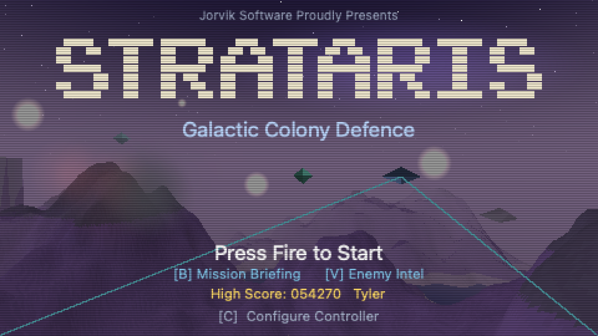
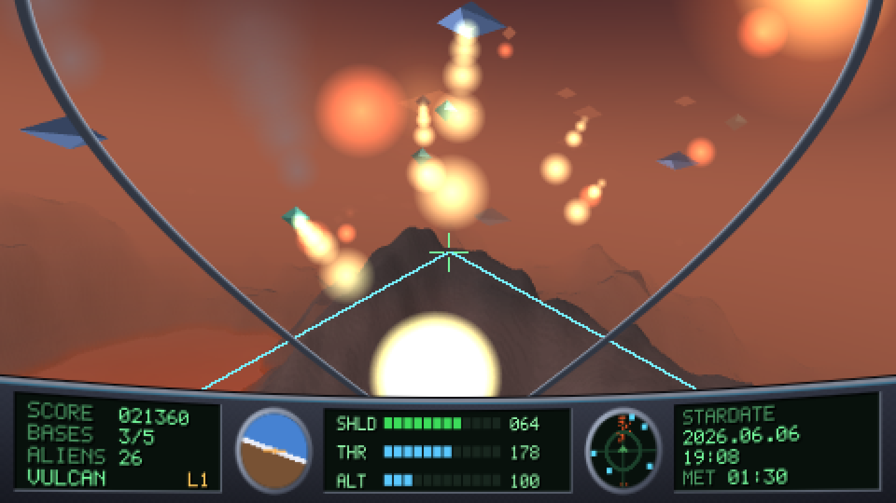
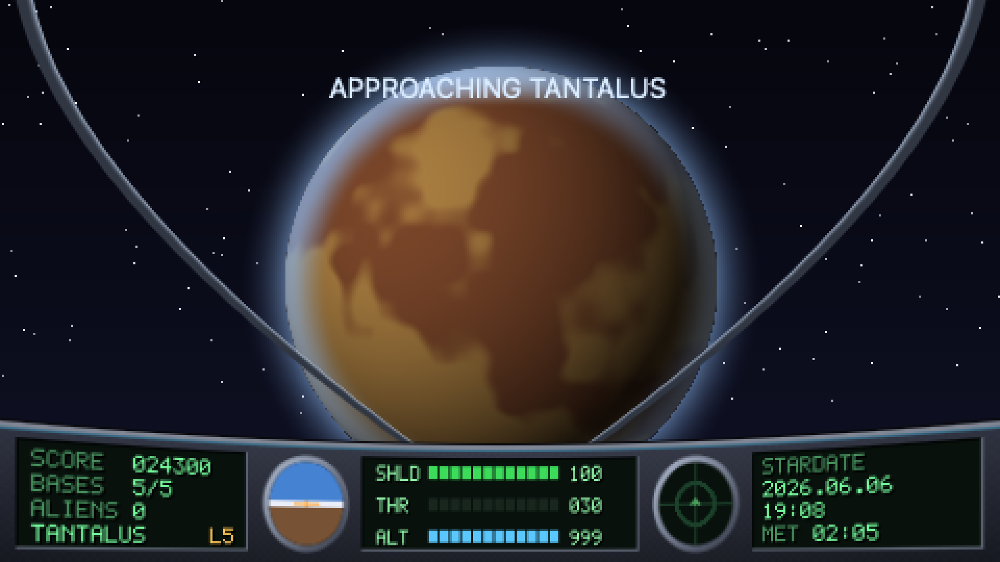
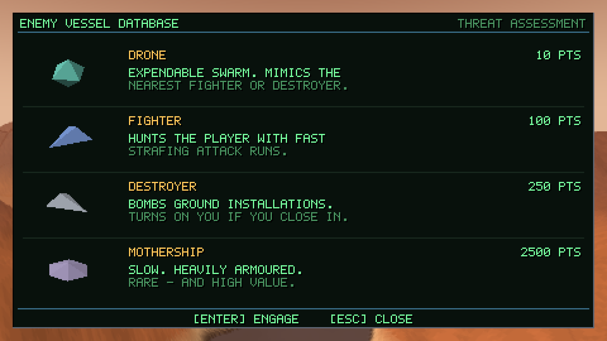
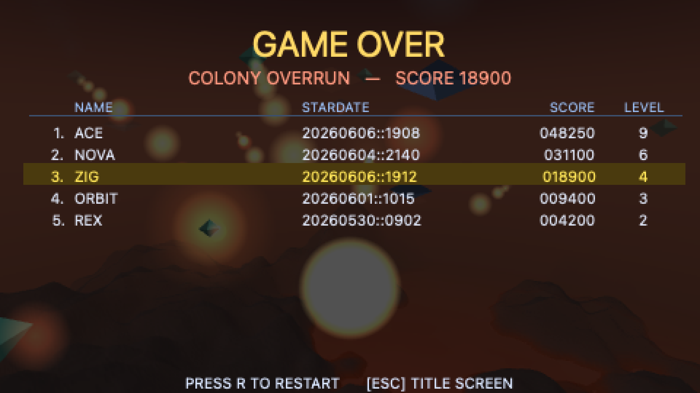

# Strataris — Galactic Colony Defence

A first-person, mesh-terrain shoot-'em-up for macOS. You fly low over alien
worlds, defend ground installations from waves of attacking craft, and warp on
to the next planet when the skies are clear — chasing a high score across an
endless campaign. *Defender* by way of *Rescue on Fractalus*, with a
period-correct pixelated look.



**The first *native* game in the Jorvik suite** — the others (Star Raiders,
Centipede, Mr. Do!) are HTML/canvas tributes.

## The whole game is about 1 MB — and there are zero asset files

Every pixel and every sound in Strataris is **generated in code**. There are no
textures, no audio files, no 3-D models, no fonts to ship:

- **Terrain** — seamless fractal-noise (fbm) heightmaps, height-banded colour,
  slope shading, distance haze.
- **Ships & installations** — flat-shaded low-poly hulls and colony buildings
  (towers, domes, hangars, habitats), a handful of triangles each.
- **Music & SFX** — a from-scratch synthesiser (square/saw/triangle/noise/
  rumble voices plus a Karplus-Strong plucked string, with envelopes, overdrive
  and a limiter); the title theme is an original long-form generative build.
- **Radio voice comms** — speech rendered offline and band-pass-filtered into a
  crackly cockpit-radio timbre, with squelch and roger bleeps.
- **Fonts** — a 5×7 bitmap font for the HUD, plus a Core Text rasteriser for
  proportional screens.
- **Particles** — smoke and fire for damaged installations.

The result: the game is **~0.85 MB per architecture** — *smaller than the asset
payload of many single web pages*, and it fits on a 1.44 MB floppy with room to
spare. Genuinely in the 16-bit spirit: demoscene-style "everything from maths,"
running as a native Mac app. (The universal binary that carries *both* Apple
Silicon and Intel is ~1.7 MB — so, fittingly, fitting both architectures on one
floppy is exactly as impossible as it was in 1995.)

> The full shipped `.app` is **~6.2 MB**, because it embeds the
> [Sparkle](https://sparkle-project.org) auto-updater framework (~3 MB) for
> in-app updates. The *game itself* is the ~0.85 MB part.

## The game

- **Fly and fight.** Bank, climb/dive, and throttle a low-flying interceptor
  over procedurally generated terrain. Fire on attacking craft; a fixed
  forward cannon and a tracking scope do the aiming work.
- **Defend the colony.** Each world has ground installations the enemy bombs.
  Lose them all and the run is over.
- **Know your enemy** (points for each):
  - **Drone** — 10 — cheap swarm.
  - **Fighter** — 100 — hunts you and strafes.
  - **Destroyer** — 250 — bombs installations; turns on you if you get close.
  - **Mothership** — 2500 — slow, heavily armoured, appears on a timer.
- **Warp onward.** Clear a planet and warp — a full cockpit cut-scene with
  engine spool, light-streaks, and re-entry — to the next world. The colonies
  are a finite, *named* cluster (Demeter, Tantalus, Boreas, Pandora, Vulcan,
  Vesper), cycled endlessly; your **level** climbs forever and is the mark of
  progression.
- **Earn upgrades.** As your level climbs you unlock combat perks, kept from
  then on: full six-degrees-of-freedom flight (level 3), an auto-targeting
  computer (6), a cloaking device (9), and a screen-clearing radial pulse (12).
- **Cockpit dashboard.** A cohesive instrument panel: flight computer readout,
  LED shield/throttle gauges, an artificial horizon, a chronometer/stardate,
  and a sweeping radar scope tracking surviving craft.
- **Mission briefing & enemy codex.** Reachable from the title screen — a
  scrolling back-story transmission and a rotating-3-D-model database of the
  alien fleet.
- **High-score table.** Name, stardate, score, and level, persisted across
  sessions.

## Screenshots

| | |
|---|---|
|  |  |
| Defending a colony as the swarm closes in. | Re-entry — warping in to the next world. |
|  |  |
| The enemy codex: a rotating 3-D threat assessment. | Run's end, and the persistent high-score table. |

## Run it

```sh
gmake build                 # universal .app via the shared jorvik-release pipeline
open .build/Strataris.app   # fly
```

### Controls

| | |
|---|---|
| **← / →** | steer (bank) |
| **↑ / ↓** | climb / dive |
| **+ / −** | throttle |
| **Space** | fire |
| **Z** | cloaking device (once unlocked) |
| **X** | radial pulse (once unlocked) |
| **R** / **Return** | start · restart · warp (on the cleared-planet screen) |
| **P** | pause |
| **M** | mute |
| **B** / **V** | mission briefing / enemy intel (from the title) |
| **Esc** | back (close briefing/codex) |
| **C** / **K** | controller / keyboard setup |
| **⌘,** | settings (audio, flight prefs, reset scores) |
| **⌘Q** | quit |

Every key is **reconfigurable** from the Keyboard sheet (**K**); the bindings
above are just the defaults.

A connected game controller (Xbox / DualShock / any Extended Gamepad) is
detected automatically; the left stick steers/pitches and the discrete actions
(fire, throttle, pause, warp, cloak, pulse) are **rebindable** from the
controller sheet. Keyboard always works as a fallback.

### Hidden feature flags

Off by default; opt in per machine with `defaults write` (relaunch to apply):

```sh
defaults write cc.jorviksoftware.Strataris ScreenshotOnSpace -bool true  # F (or a rebindable gamepad button) saves a 1920×1080 PNG (4× nearest-neighbour) to the Desktop; Space stays fire
```

### Headless smoke test

Exercises the renderer-independent game logic (AI intent, structures, return
fire, scoring, persistence), the 2D canvas draws, the 6DOF flight model, and a
best-effort GPU mesh render (skipped gracefully where there's no Metal device):

```sh
STRATARIS_SMOKE=1 ./.build/Strataris.app/Contents/MacOS/Strataris
```

On an M3 Max the GPU mesh frame (encode + readback) runs ~1.3 ms at 480×270 —
the framebuffer is upscaled, nearest-neighbour and aspect-correct (letterboxed),
to fill the window.

## Architecture

The world is a GPU triangle-mesh terrain composited with a hand-built 2D
cockpit/HUD, then blit-upscaled nearest-neighbour for the pixelated look. See
**[ARCHITECTURE.md](ARCHITECTURE.md)** for the rendering pipeline and a per-file
source map.

## Support

If you enjoy Strataris, you can [**buy me a coffee**](https://jorviksoftware.cc/donate) ☕ — it keeps the Jorvik lights on.

---

*A Jorvik Software game.*
